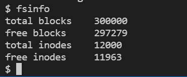
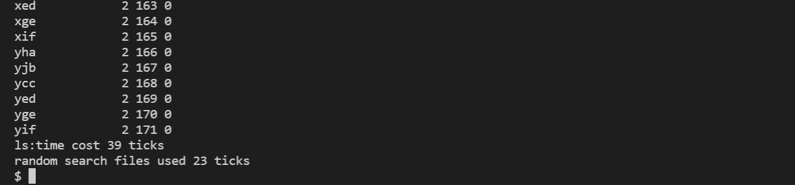
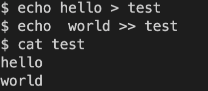

# file system for xv6

Developer: Qi  Ma [envelope:email](mq19@mails.tsinghua.edu.cn), Leyi  Pan,  Ao Sun, Peiran  Xu

[TOC]


## 1. File system background introduction

The xv6 file system is a relatively lightweight file system, mainly composed of 7 layers: the `disk` layer reads and writes blocks (blocks) on the virtual hard disk; the `buffer cache` layer caches disk blocks and synchronizes access to them; ` The logging` layer can be used for recovery after a file system crash; the `inode` layer corresponds to a single file, each file has an `inode` and blocks to store data; the `directory` layer implements directories as special `inode`, The content is a series of directory items (storing the file name and `inode` number); the `pathname` layer enables the operating system to recursively query the files under the path; the `file descriptor` layer abstracts devices, pipes, files, etc. to realize The upper layer interface of the file system.

Although the file system of xv6 already has relatively complete functions, compared with mainstream file systems (such as `ext2/3/4` file system of Linux, `fat32`/`NTFS` file system of Windows), xv6 file system There are still many deficiencies in performance and functionality. Our team's big project implemented `ext3` filesystem and `ext4` (partially) for xv6.

### 1.1 Ext file system

The full name of the Ext file system is the Extended File System. It is the file system of the Linux operating system. There are multiple versions of Ext2/3/4. Now most Linux uses the ext4 file system.

### 1.2 Implemented content

We have implemented 9 major functions, which will be introduced in detail in the technical framework section


## 2. Technical framework

### 2.1 Support for large files

The current single file size of xv6 supports 12 direct indexes and 1 first-level indirect index, that is, a maximum of 12+256, a total of 268 blocks, and a total of 268KB. The largest part comes from the indirect index, which actually indexes a new disk block, and stores up to 256 disk block numbers on this disk block. The disk blocks represented by these numbers actually store the original files.

In order to make xv6 support larger files, you can use the method of adding secondary indirect index and tertiary indirect index. Similarly, indexing recursively in this way exponentially increases the maximum file size the file system can support. Through the second and third levels of indirect indexing, a single file can reach a maximum of $12+256+256^2+256^3=16,843,020$ blocks, namely **16.8GB**.

#### 2.1.1 Implementation details

+ Modify MAXFILE in `fs.h`
+ Modify FSSIZE (total file system size) in `param.h`, originally 1000, changed to 300000
+ Modify `bmap()` and `itrunc()` in `fs.c`, add secondary index and tertiary index content
+ Write the user program `big.c` as a test program

### 2.2 Soft link (symbolic link)

Soft link (symbolic link) implements a special file, which has a special type identifier `T_SYMLINK`, similar to hard link (link), the function of this file is to complete the image of an existing file , when the linked file changes, the reading of the linked file should also change. Different from hard links through "copy", that is, directly copying the original file, soft links store the path of the linked file. When accessing the soft link file, it will jump to the linked file, similar to "shortcut Way". If the linked file is also a soft link, it will jump recursively. When the linked file is deleted, the soft link will also become invalid.

#### 2.2.1 Implementation details

+ `syscall.h` adds `symlink` system call
+ `stat.h` added file type SYMLINK
+ `fcntl.h` adds file opening method O_NOFOLLOW
+ `sysfile.c` adds `symlink` function implementation
+ `sysfile.c` modify the sys_open,create function to support the creation of soft links, and open the linked files correctly when opening soft link files
+ Write the user program test.c as a test file
+ Use a test file symlinktest.c in the xv6 official github repository for a more complete test: https://github.com/mit-pdos/xv6-riscv-fall19/blob/xv6-riscv-fall19/user/symlinktest.c

### 2.3 Add access permissions to files

In file systems such as ext3/4, read/write permissions to files can be controlled. The following are the technical points of the implementation:

* Add read and write permissions to the file

     * Add the `rwmode` variable in `inode`, which is a two-digit binary number. The first bit indicates whether it can be read (1 means it can), and the second bit indicates whether it can be written (1 means it can)

     * When creating a file, initialize the file's `rwmode=11` by default

     * The root user can change the read and write permissions of a file through the newly added system call `chmode(char *pathname, int mode)`; for example, if `rwmode` is changed to 10 (that is, 2 in decimal), it is read-only Can't write anymore. At this time, trying to write to the file again will report an error.

     * Modify the `ls` system call to print out the read and write permissions of each file.

* Protection of sensitive files

     * Add `supermode` variable in `inode`, `supermode` is 1 means the file is a sensitive file, only the administrator can open it; `supermode` is 0 means the file is an ordinary file, ordinary users can also open it

     * Modify the system call `open()`, add a parameter password to `open()`, and add a judgment: when the file `supermode = 1` and the password input is wrong, it cannot be opened

     * When creating a file, initialize the file's `supermode = 0` by default

     * You can change whether a file is sensitive or not through the new system call `chspmode(char *pathname, char *password, int supermode)`

     * Modify the `ls` system call to print whether each file is sensitive

### 2.4 inode bitmap

In the ext3 file system, the inode bitmap is used to record the allocation status (free/allocated) of `inode`. There is no inode bitmap in xv6, so when xv6 needs to allocate an inode, it needs to traverse the inode until it finds a free inode. After using the inode bitmap, the allocation efficiency can be improved, and it is convenient for users to view the information of the current file system, such as how much space is available on the disk.

The following are the technical points of the implementation:

* Introduce inode bitmap

     * Modify `mkfs.c` to determine the number and location of inode bitmap blocks in `fs.img` when the file system is initialized.

     * Modify the `ialloc` function, when allocating a new inode, no longer read the inode block, traverse each `dinode` and check its `type` to determine whether it is free, but read the inode bitmap, traverse the bits in it Find free inodes and modify their status bits after allocation.

     * Modify the `iput` function to zero its corresponding position in the inode bitmap whenever the `nlink` number of an inode decreases to 0.

### 2.5 fsinfo

Based on the inode bitmap implemented above, the number of free data blocks and inodes in the file system can be further obtained

#### 2.5.1 Implementation details

Add system calls and corresponding user programs `fsinfo` to view file system information (total/free disk blocks/number of inodes)

* Add `freeinodes` and `freeblocks` domains in `superblock` to dynamically record the number of free inodes and disk blocks respectively, and initialize them in `mkfs.c`

* Maintain a global `superblock` copy in memory, and set a spin lock for it, and update its `freeinodes` and `freeblocks` domains after calling `ialloc/iput`, `balloc/bfree`

* Add the `updatesb` function, which is called immediately after the `superblock` in memory changes, and writes the changes to the superblock block on the disk

* Add `fsinfo` system call and user program, copy the `superblock` in the memory to the page table of the user process

### 2.6 HTree directory index

xv6 The files in a directory are indexed linearly. When you need to find a specific file name in a directory, you need to linearly traverse all directory entries in the directory (directory entries store the file name and the inode number of the file) until you find The document. Not only does this make file lookups very slow, but it also makes creating files slower, because before creating a file, it first checks to see if the filename already exists.

In the ext3 file system, the files in the directory are indexed in a tree structure. But it is not a standard B tree, but HTree, H is a hash (hash), that is, the hash value of the file name is used as the key value to build a tree to realize the index. This kind of HTree is characterized by a large branching factor, and the depth is generally 1 to 2 layers, and no rebalancing is required. This algorithm was proposed by Daniel Phillips in 2000 and implemented in the ext2 file system in 2001, and was applied to the ext3 and ext4 file systems.

#### 2.6.1 HTree implementation ideas

In order to implement Htree, we read Daniel Phillips's paper [A Directory Index for Ext2](https://archive.ph/20130415075208/http://www.linuxshowcase.org/2001/full_papers/phillips/ phillips_html/index.html#selection-99.0-99.26)”. The basic idea of its implementation is as follows:

* Implementing standard B-tree directory indexing in ext requires a huge amount of engineering (the amount of code is about the same as the ext file system itself), and rebalancing operations to maintain the tree height will require complex operations of pointer arithmetic. However, HTree adopts the idea of **logical addressing** instead of physical addressing for B-trees, making this data structure between B-trees and hash tables.

* Leaf node of HTree: a large yellow area in the right column in the figure below is a leaf block, corresponding to a range of hash values, and there are multiple directory entries (dir\_entry) in a leaf node .

* File search: When you need to find a file, first calculate the hash value of the file name, and then **determine which hash value range the hash value belongs to, so as to determine which leaf node the hash value corresponds to. After the leaf node is determined, the file to be searched is further searched inside the leaf node. The directory entries inside the leaf nodes are arranged linearly.

* 
     * HTree schematic diagram, source: [EXT3 Directory Index Mechanism Analysis](https://oenhan.com/ext3-dir-hash-index)

* File creation: The creation process is similar to the search process. First calculate the hash value based on the file name, then determine which leaf node it belongs to, and then check whether the file name already exists in the leaf node, and create it if it does not exist it.

* Handling of hash conflicts: HTree handles hash conflicts across leaf nodes, and the conflicting items are stored in the next leaf node. We did not adopt this strategy, but divided a separate area in the entire file system to store files with hash collisions.

#### 2.6.2 Implementation Details

+ Added `tree_search` function of HTree in `fs.c` to search HTree
+ Added `build_dir_tree` function of HTree in `fs.c` to initialize HTree under directory
+ Added `tree_expand` function in `fs.c` to dynamically expand the size of the tree
+ Modify the `dirlookup` function and `dirlink` function in the `fs.c` file, and change the linear traversal to call the `tree_search` function
+ in `fs.
The `BKDRHash` function is added in the c` file to calculate the string hash value. The characteristic of the BKDR string hash algorithm is that every character in the string participates in the calculation of the hash value, so that even if two file names are very similar (for example, only one character is different), the final hash value will be very different.

#### 2.6.3 Why use HTree instead of hash table

The advantage of HTree over the hash table is that the hash table has a hash value for each file name. When there are fewer files, the distribution will be very sparse, resulting in disk storage fragmentation. When it is necessary to traverse all files in a directory (for example, the user calls the `ls` command), the hash table will not have an advantage, because it needs to visit all directory entries to determine whether the directory entry is empty or points to a file. The HTree reduces this sparsity through the continuous storage inside the leaf nodes.

### 2.7 Extents feature

#### 2.7.1 Extents introduction and implementation ideas

Extents is a new feature of **Ext4 file system**, which is a collection of data blocks (blocks) with consecutive addresses.

Defects of Ext3 for very large files: In the original Ext3 file system, multi-level linking is used to index blocks. For very large files, there is a defect that it will use a lot of blocks, and this indexing method of ext3 will give each Each block has a link, so the link itself takes up a lot of space and is slower to access.

After changing to the extents method, since multiple blocks have consecutive addresses, it is only necessary to record the start addresses and lengths of these consecutive blocks, which reduces file fragmentation, reduces the space occupied by links, and improves file system access performance. This method is more suitable for very large files.

#### 2.7.2 Implementation details

+ Add new file type `T_EXTENT` to stat.h
   + In order to be compatible with the original block map method, add the flag `T_EXTENT` to the file created by the extent method. Before accessing the file, judge whether it is of type `T_EXTENT`. If yes, access the data block according to the extent method. If not, Access data blocks in the same way as the original multi-level linked index.

+ Add `O_EXTENT` to fnctl.h
+ modify function `sys_open` in sysfile.c, add opening/creating Extent type files
+ fs.c modifies the bmap function and increases the extent block allocation method, which allocates a continuous set of blocks
+ Add test file extenttest2.c

### 2.8 Recycle Bin

Added recycle bin function for xv6: the original deletion command of xv6 is `rm`, which means permanent deletion. We have added `delete` and `refresh` commands for the xv6 filesystem. When the user executes the `delete` command, the file will be moved to the recycle bin, and the file cannot be accessed at this time. Files already in the recycle bin will be permanently deleted if `delete` is executed again. In addition, if you execute the `refresh` command on a file in the recycle bin, the file will be restored.

#### 2.8.1 Implementation details

The following are the technical points of the implementation:

- Added display variable `showmode` in `dinode` and `inode`, `showmode=0` means the file is hidden, `showmode=1` means the file can be seen.
- Modify the `fileread()` and `filewrite` functions in `file.c`, and add a judgment: if the file is hidden (in the recycle bin), it cannot be read or written
- Add `sys_delete` system call, when the file is not in the recycle bin, execute this system call, then the file will be moved to the recycle bin (`showmode=0`); if the file itself is in the recycle bin, it will be permanently deleted (similar to `unlink` code)
- Add `sys_show` system call. When executing this system call, if `showmode` is originally 0, then `showmode` will be changed to 1.
- Add `delete`, `refresh` user programs, where `delete` calls `sys_delete`, and `refresh` calls `sys_show`.
- Modify the `ls` user-level program to print file information only when `showmode=1`
- Add `recyclelist` user-level program, which can print the file information in the recycle bin

### 2.9 lseek and append

#### 2.9.1 Introduction to lseek

When reading and writing files, the file pointer is used to indicate the current reading and writing position. lseek can modify the position pointed by this pointer, thus realizing reading and writing files from the specified position

There are three ways to use lseek

+ offset the off bit from the beginning of the file: **lseek**(fd, off, SEEK_SET);

+ Offset from the current position of the file: **lseek**(fd, off, SEEK_CUR);

+ Offset from the end of the file: **lseek**(fd, off, SEEK_END);

#### 2.9.2 append introduction

append is a way to open a file, which means writing characters from the end of the file in an appended way. Can be used with the redirection operator `>>`.

#### 2.9.3 Implementation Details

*lseek
   * Add ```lseek``` system call, set the read/write offset `off` of a given file to the specified position according to the parameters passed in by the user (base point and offset size, positive or negative)

   * Use macro definition 0,1,2 to represent SEEK_SET, SEEK_CUR, SEEK_END

* append and the command line redirection operator `>>`

   * Add the open method flag `O_APPEND`, passing this flag will set the `off` of the open file to the end of the file in the `open` function
   * Add the parsing of the operator `>>` in `sh.c`, so that the output of the command on the left is written to the file on the right in append mode


## 3. Function effect

### 3.1 Large files

Added second and third-level indirect indexes for xv6, and the maximum size of a single file can reach ==16.8GB==.

The figure below shows that after adding the secondary index, the maximum file size is $12+256+256^2+256^3=16,843,020$ blocks. The test code used is the user-level program big.c. This test code refers to the official test file of MIT's 6.828 course for testing large file functions https://pdos.csail.mit.edu/6.828/2018/homework/big .c

Every time 100 blocks are written, a line of prompt information is output. We have written 100,000 blocks, exceeding the upper limit of the second-level link (more than 60,000 blocks), indicating that the third-level link has been successfully implemented.

The recorded running video is in the `demo or test video/bigfile.mp4` directory, (this video is only used to prove that we have successfully implemented support for large files, and the video is longer (29 minutes) and contains only The running process information is recorded, without explanation, you can directly drag the progress bar to the end to view the final result)


### 3.2 Soft link (video demonstration)

Implemented the function of adding soft links to xv6, making the relationship between files more flexible. Write the test code and record the screen, the video is located in `Demo or Test Video\Soft Link.mp4`.

** Note: ** The video has a commentary (but no subtitles), please turn on the sound.

This video has a total of 2 minutes, showing the test soft link code written by Sun Ao himself, and the running results of a test soft link program by MIT.

### 3.3 File Access Control (Video Demonstration)

At present, functions such as the control of file read and write permissions and the setting of sensitive files have been realized. We have recorded a video demonstration of this function. **Video** file location is `Demo or test video/read and write permissions_protect sensitive files.mp4` (about 4 minutes). The video has a commentary, but no subtitles, please turn on the sound.

### 3.4 inode bitmap

#### 3.4.1 fsinfo view file system information

Users can enter `fsinfo` in the shell to print the file system information. The following figure shows the file system information in the initial state.




#### 3.4.2 Improve inode allocation speed

The original `ialloc` method of xv6 reads the inode block, traverses each `dinode` and checks its `type` to determine whether it is free. In the worst case, it needs to execute `NINODES/IPB + 1` `bread` operations ; and the introduction of inode bitmap is equivalent to "condensing" the state information of inodes to 1bit. In the worst case, it only needs to execute `NINODES/BPB + 1` times `bread`, which should improve the efficiency to a certain extent in theory. In the experiment, new files were created in batches on the original system and the modified system, and the `uptime` function of xv6 was called to measure its time:

Batch creation of 1024 files to allocate inode time (before improvement, test in the original xv6 system, note that the macro definition \#define NINODES in mkfs.c needs to be increased to not less than the test scale):


Batch creation of 1024 files to allocate inode time (improved):


For the test size of 1024, **inode allocation speed increased by 73.7%**. The running speed may vary on different machines, but the increased speed is basically between 60 and 70%. And with the increase of the test scale, the improvement effect is more obvious.

### 3.5 HTree directory index

The speed of finding files in the directory is improved through the Htree index, and the time taken to create 150 files, `ls` to print the directory, and randomly search for 150 files is tested (unit tick)

#### Original xv6 test result (without HTree)


The print result of the intermediate directory is too long (150 file names), part of which is omitted in the screenshot



#### Realize the test results of HTree

The results have been organized as follows (you can get it by running search_test in our xv6 system)

| Unit (tick) | Original xv6 | HTree | Boost |
| ------------- | ----- | ----- | ----- |
| 150 files created | 77 | 37 | 51.9% |
| Sequential Access | 39 | 16 | 59.0% |
| Random Access | 23 | 8 | 65.2% |

It can be seen that the speed of these three indicators has increased by 51.9%, 59.0%, and 65.2% respectively**

### 3.6 Extents

The advantages of extents are not obvious when the scale is small, but when the scale is particularly large, the speed of reading files will be significantly improved.

Write the test file extenttest2.c, you can directly execute this command in the xv6 system for testing.

```
extenttest2 [number of blocks]
```

Read and write 50,000 blocks into a single file using the link index method of ext3 and the extents method of ext4


It can be seen that the time to read the file is significantly shortened.

| Scale n=50000 blocks | Original xv6 | Extents |
| ------------- | ----- | ------- |
| Write File | 7343 | 7719 |
| Read file | 707 | 14 |

It will take a long time to run, it will take **half an hour**, we have recorded a screen recording file `demo or test video/extenttest.mp4`, you can **directly drag it to the end of the progress bar** to see the result.

### 3.7 Recycle Bin

- Run the `open ./file 1` command to create a new file `file`, which can be viewed through the `ls` command (here, the ls print list is not complete, and there are rm and grind files under the zombie)

   

- Run the `delete ./file` command, if it is successfully moved to the recycle bin, a prompt will be displayed on the terminal. Use the `ls` command to print, and you can find that the `file` file is no longer in the list.

   

   

- Run the `recyclelist` command to print the file list of the recycle bin, and you can see that the `file` file is in the recycle bin

   

- At this point, if you try to read or write to `file` (such as writing hello), an error will be prompted.

   

- If you execute the `refresh ./file` command at this time, you can see by `ls` printing that the `file` file has been restored.

   

   

- If `file` is not restored in the previous step, but `delete` is executed again, the file will be permanently deleted, achieving the same effect as `rm`.

### 3.8 lseek

We wrote a test file `lseektest.c` to test the three usages of lseek. In this test file, we write characters from the following positions in a string of length 20:

+ Calculate 4 offsets from the beginning of the file and write 3 1s
+ Calculate 4 offsets from the current read and write position of the file and write 3 2
+ Calculate the backward 2 offset from the end of the file and write 3 3

The running result is as shown in the figure below, and we can see the symbol we expected.


### 3.9 append

We use a simple command to verify the function of append. Originally, there is already content "hello" in test. Use `>>` to append the content "world" to the text file test, and then check the content in the file, you can see success Add content to the end of the file instead of overwriting the original file.




## 4. Environment Configuration

The operating environment of our team is the Windows Subsystem for Linux (WSL), the Ubuntu operating system, and the configuration process is as follows

### Environment configuration on Windows

1. Install [Windows Subsystem for Linux](https://docs.microsoft.com/en-us/windows/wsl/install-win10) (WSL)

2. Install [Ubuntu 20.04 from the Microsoft Store](https://www.microsoft.com/en-us/p/ubuntu/9nblggh4msv6) on WSL.

3. Install the compilation toolchain in Ubuntu:

    1. ```
       $ sudo apt-get update && sudo apt-get upgrade
       $ sudo apt-get install git build-essential gdb-multiarch qemu-system-misc gcc-riscv64-linux-gnu binutils-riscv64-linux-gnu
       ```

4. Enter the xv6 decompressed directory, right-click to open with vscode, and enter in the shell

```
make qemu
```

==Note==: It will take a long time to run make qemu for the first time. This is because the file system image needs to be created. Since our team needs to implement large files, the created file system image is very large (300,000 blocks) , you should wait for 2-3 minutes when executing the output to the following paragraph, it is creating a file system image, please wait patiently for a while.

```
# Wait a while after outputting this line
nmeta 1587 (boot, super, log blocks 45, inode bitmap blocks 2, inode blocks 1501, bitmap blocks 37) blocks 298413 total 300000
```


Note: To exit the xv6 system under windows, press `ctrl`+`a` and release it, then press `X`

If you are not a windows operating system, such as macos, just refer to https://pdos.csail.mit.edu/6.828/2021/tools.html for the configuration process.

If you want to clear the compiled operating system

```
make clean
```

## 5. Command to run the code

#### 5.1 Commands for large files

(Use it with caution, it will take a long time to run, it is recommended that you directly watch our screen recording file, so you can directly drag the progress bar to the end to see the result)

```
big
```

This is a test program, the user program big, which will continue to write content to a file before the set file size is reached, so as to test whether a file can reach a large enough size. During operation, the block counter will update the number of written blocks in real time on the command line, and report the test success after reaching the preset number.

#### 5.2 Soft link

```
test
symlinktest
```

There are two test files for soft links: `test` and `symlinktest`

- `test` is a simple test program that only tests the creation process of soft links. But the created file can be displayed by the `ls` command, and then you can continue to operate on the file to verify whether the soft link is successful (we demonstrate how to use the soft link in the screen recording file `soft link.mp4`).
- `symlinktest` is a comprehensive soft link test, which includes almost all possible problems in the process of creating, modifying and deleting soft links. This test function comes from the xv6 official github repository: https://github.com/mit-pdos/xv6-riscv-fall19/blob/xv6-riscv-fall19/user/symlinktest.c

#### 5.3 Commands for file access permissions

```
chmode [filename] [0/1/2/3]
```

The second parameter: 0 means unreadable and unwritable

1 means not readable and writable

2 means only readable but not writable

3 means both readable and writable

```
chspmode [filename] [admin password] [0/1]
```

Administrator identity password input `iam@admin9876`

The third parameter 0 means it is set as a normal file, and 1 means it is set as a sensitive protected file

#### 5.4 Recycle bin commands

```
delete [file]//delete file
```

```
refresh [file]//restore file
```

```
recyclelist//Display the files in the recycle bin
```

```
Files in the delete recycle bin can be permanently deleted
```

#### 5.5 View system free space status

```
fsinfo
```

#### 5.6 lseek positioning read and write position and append

```
lseektest
```

This command will test the lseek function, and the test results can be seen in section 3.8.

The function of append can be used by the relocation symbol `>>` to append characters to the text file.

```
echo [string] >> test.txt
```

#### 5.7 Commands of directory search tree Htree

```
search_test
```

This command will create more than 150 files and perform sequential access and random access, and output the running time. See section 3.5 for the running results.

#### 5.8 Commands for extents performance testing

This command will test the speed comparison between ext3's multi-level link index and ext4's extents. The first parameter is the number of blocks to be tested. Note that the effect of extents is not obvious when the number of blocks is small, and a relatively large number of blocks is required, but it takes a long time (30 minutes for a comparison of 50,000 blocks). You can see our screen recording file `video/ extenttest.wav`, so that you can directly drag the progress bar to the end to see the result.

```
extentstest2 [number of blocks]
```

#### 5.9 Inode bitmap commands

```
ibmaptest [number of inodes]
```

The first argument is the number of allocation `inode` to test. will output the time spent allocating the specified number of `inode` to create an empty file.

In order to facilitate your comparison, we have recorded a video `demo or test video/comparison_old_xv6_ibmap_500.mp4` of the time it takes for `ibmaptest` to allocate 500 `inode` on the original xv6 system.

#### 5.10 Commands for usertests

xv6 comes with the `usertests.c` file, which can test whether there are bugs in all aspects of the operating system. After implementing the new functions and modifications, we passed its `usertests`, indicating that we did not destroy the original functions. .

```
usertests
```

## 6. Division of labor

| Members | Tasks |
| ------ | ------------------------------------------ ------------------ |
| Qi Ma | Preliminary research, implementation of HTree directory index, extent features, merging branches, organization of group discussions, report writing |
| Peiran Xu | Preliminary research, implementation of inode bitmap, lseek and append, report writing |
| Ao Sun | Preliminary research, implementation of large file support and soft links, report writing |
| Leyi Pan | Preliminary research, file access control, recycle bin, report writing |

## 7. References

1. MIT's 6.828 course is used to test the official test file of the large file function https://pdos.csail.mit.edu/6.828/2018/homework/big.c

2. Soft link test file symlinktest.c of xv6 official Github repository: https://github.com/mit-pdos/xv6-riscv-fall19/blob/xv6-riscv-fall19/user/symlinktest.c

3. Daniel Phillips proposed the HTree algorithm paper

    Phillips, Daniel. "A Directory Index for {EXT2}." 5th Annual Linux Showcase & Conference (ALS 01). 2001. https://archive.ph/20130415075208/http://www.linuxshowcase.org/2001/full_papers/phillips/phillips_html/index.html#selection-99.0-99.26

4. Blog: Analysis of EXT3 Directory Indexing Mechanism https://oenhan.com/ext3-dir-hash-index

5. Extents feature: https://github.com/RitwikDiv/xv6-PA4