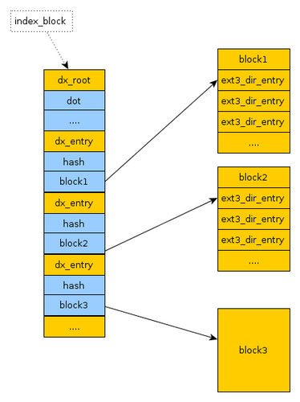
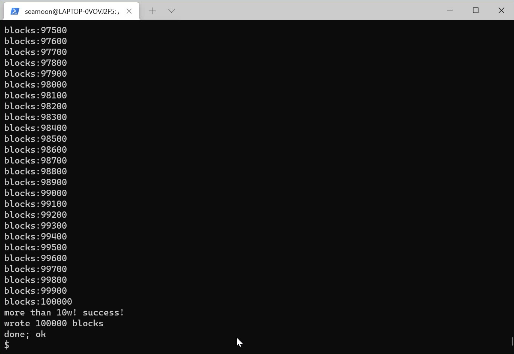
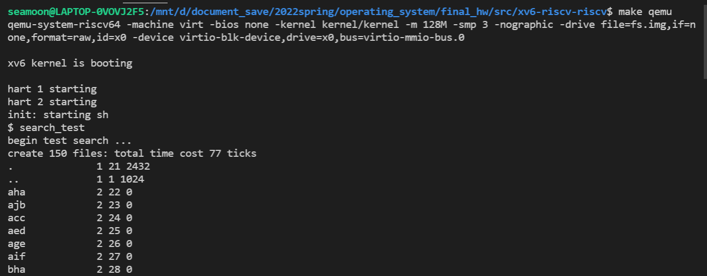
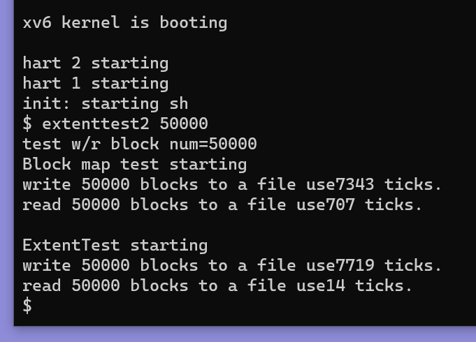
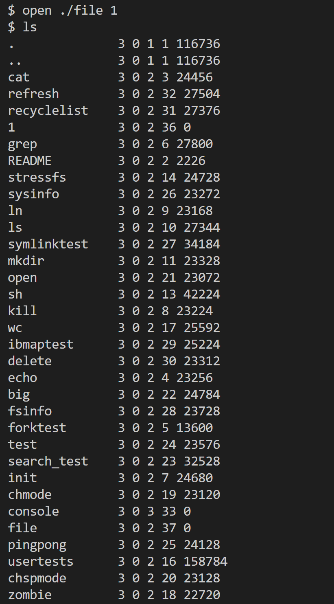
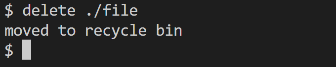
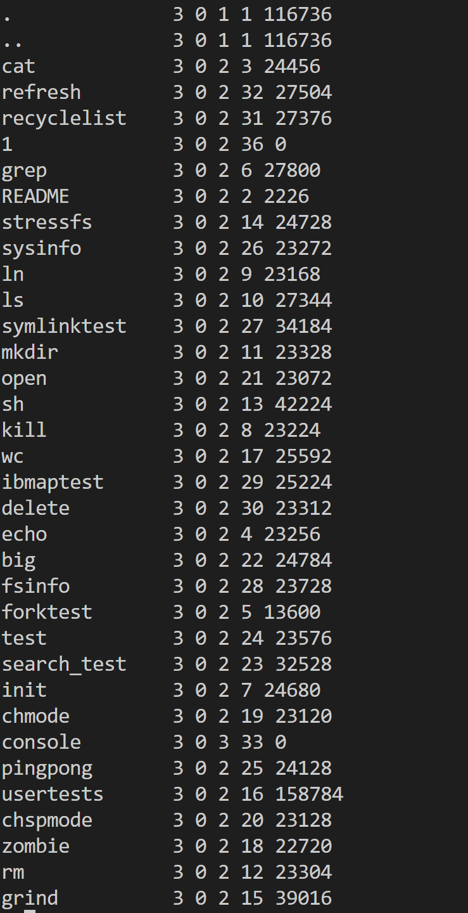
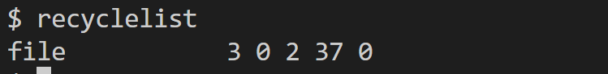
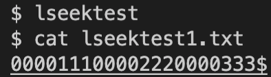

# xv6文件系统

开发者：马骐 [:envelope:email](mq19@mails.tsinghua.edu.cn) 潘乐怡  孙骜  徐霈然

[TOC]


## 1. 文件系统背景介绍

xv6文件系统是一个相对轻量级的文件系统，主要由7层构成：`disk`层在虚拟硬盘上读写块(block)；`buffer cache`层缓存磁盘块并同步对它们的访问； `logging`层可以用于文件系统崩溃后的恢复； `inode`层对应于单个文件，每个文件有一个 `inode`和存储数据的块；`directory`层将目录实现为特殊的 `inode`，内容为一系列目录项(存放文件名和`inode`编号)；`pathname`层使得操作系统可以以递归的方式查询路径下的文件；`file descriptor`层将设备、管道、文件等进行抽象，实现了文件系统的上层接口。

尽管xv6的文件系统已经具有相对完整的功能，但是相比于主流的文件系统（例如Linux的 `ext2/3/4`文件系统、Windows的 `fat32`/`NTFS`文件系统），xv6文件系统在性能和功能上仍有很多不足。我们小组大作业为xv6实现了 `ext3`文件系统和`ext4`（部分）。

### 1.1 Ext文件系统

Ext文件系统全称Extended File System，是Linux操作系统的文件系统，有Ext2/3/4多代版本，现在大部分Linux使用的是ext4文件系统。

### 1.2 实现的内容

我们实现了9大功能，将在技术框架部分展开详细介绍


## 2. 技术框架

### 2.1 支持大文件

xv6目前的单个文件大小支持为12个直接索引和1个一级间接索引，即最大12+256，共268个block，总计268KB。其中最大部分来自于间接索引，它实际上索引到了一个新的磁盘块，在这个磁盘块上保存了最多256个磁盘块编号，这些编号代表的磁盘块是实际存储原文件的。

为了使xv6支持更大的文件，可以采用增加二级间接索引和三级间接索引的方式，二级索引对应的磁盘块上存储的磁盘块编号全部为一级索引对应的磁盘块，三级索引类似，通过这样递归地进行索引，以指数级扩大了文件系统所能支持的最大文件大小。通过二、三级间接索引，单个文件最大可以达到$12+256+256^2+256^3=16,843,020$个block，即**16.8GB**。

#### 2.1.1 实现细节

+ 修改`fs.h`里的MAXFILE
+ 修改`param.h`里的FSSIZE（文件系统总大小），原本是1000，修改为300000
+ 修改`fs.c`里的`bmap()`和`itrunc()`，增加二级索引、三级索引内容
+ 编写用户程序`big.c`作为测试程序

### 2.2 软链接（符号链接）

软链接(symbolic link)实现了一种特殊的文件，这种文件有着特别的类型标识 `T_SYMLINK`，与硬链接（link）相似，这种文件的作用是完成对于已有的某个文件的映像，在被链接文件改变时，对链接文件的读入也应该改变。与硬链接通过“副本”，即直接将原有文件拷贝的实现方式不同，软链接通过存储被链接文件的路径，在对软链接文件访问时，会跳转至被链接文件，类似于“快捷方式”。若被链接文件也为软链接，则会递归地跳转。当被链接文件删除后，软链接也会失效。

#### 2.2.1 实现细节

+ `syscall.h` 增加`symlink`系统调用
+ `stat.h `增加文件类型SYMLINK
+ `fcntl.h` 增加文件打开方式O_NOFOLLOW
+ `sysfile.c` 增加`symlink`函数实现
+ `sysfile.c `修改sys_open,create 函数，使其支持创建软链接，并且打开软链接文件时可以正确打开被链接文件
+ 编写用户程序test.c作为测试文件
+ 使用xv6官方github仓库的一个测试文件symlinktest.c进行更完备测试:https://github.com/mit-pdos/xv6-riscv-fall19/blob/xv6-riscv-fall19/user/symlinktest.c

### 2.3 为文件增加访问权限

在ext3/4等文件系统中，可以控制对文件的读/写权限。下面是实现的技术要点：

*   为文件增加读写权限

    *   在`inode`中增加 `rwmode`变量，为两位二进制数，第一位表示是否能读（1表示能），第二位表示是否能写（1表示能）

    *   创建一个文件时，默认初始化该文件的 `rwmode=11`

    *   root用户可以通过新增的系统调用 `chmode(char *pathname, int mode)`来改变某一个文件的读写权限；例如将 `rwmode`改为10（即十进制的2）了，就只读不能写了。此时再试图写入该文件，会报错。

    *   修改 `ls`系统调用，可以打印出每个文件的读写权限。

*   对敏感文件的保护

    *   在`inode`中增加 `supermode`变量，`supermode`为1表示该文件为敏感文件，只有管理员才能打开；`supermode`为0表示该文件为普通文件，普通用户也能打开

    *   修改系统调用 `open()`，为 `open()`增加了一个参数password，并增加判断：当该文件 `supermode = 1`且password输入错误时不能打开

    *   创建一个文件时，默认初始化该文件的 `supermode = 0`

    *   可以通过新增的系统调用 `chspmode(char *pathname, char *password, int supermode)`来改变一个文件是否敏感

    *   修改 `ls`系统调用，可以打印出每个文件是否敏感

### 2.4 inode bitmap

在ext3文件系统中，使用inode bitmap来记录 `inode`的分配状态（空闲/已分配）。在xv6中没有inode bitmap，因此当xv6需要分配一个inode时，需要遍历一遍inode直到找到一个空闲的inode。使用inode bitmap后，可以提高分配效率，并方便用户查看当前文件系统的信息，比如磁盘还有多少空间可用。

下面是实现的技术要点：

*   引入inode bitmap

    *   修改 `mkfs.c`，使文件系统初始化时确定inode bitmap块在 `fs.img`中的数目、位置等。

    *   修改 `ialloc`函数，当分配新inode时不再读出inode块、遍历其中每一个 `dinode`并查看其 `type`来确定其是否空闲，而是读出inode bitmap，遍历其中的位来找到空闲的inode，并在分配后修改其状态位。

    *   修改 `iput`函数，每当inode的 `nlink`数减少至0时将其在inode bitmap中的相应位置零。

### 2.5 fsinfo

基于上面实现的inode bitmap，可以进一步得到文件系统内空余的数据块和inode的数量

#### 2.5.1实现细节

增加系统调用及相应用户程序 `fsinfo`查看文件系统信息（总共/空闲磁盘块/inode数）

*   在 `superblock`中增加 `freeinodes`和 `freeblocks`域分别动态记录空闲的inode数和磁盘块数，并在 `mkfs.c`中初始化

*   在内存中维护一份全局的 `superblock`副本，并为其设一把自旋锁，每当调用 `ialloc/iput`、`balloc/bfree`后更新其 `freeinodes`和 `freeblocks`域

*   增加 `updatesb`函数，每当内存中 `superblock`发生变化后立刻调用，将改动写入磁盘的superblock块

*   增加 `fsinfo`的系统调用和用户程序，将内存中的 `superblock`拷贝到用户进程的页表

### 2.6 HTree目录索引

xv6一个目录下的文件是以线性的方式索引的，当需要在一个目录下查找特定文件名时，需要线性遍历目录中的所有目录项（目录项存储了文件名和文件的inode编号），直到找到该文件。这不仅会使得文件查找非常慢，也会使得创建文件变慢，因为创建一个文件前会首先查找这个文件名是否已经存在。

而在ext3文件系统中，目录下的文件是以树形结构索引的。但不是标准的B树，而是HTree，H是哈希(hash)，即以文件名的哈希值作为键值构建树，实现索引。这种HTree的特点是分支因子大，深度一般为1到2层，不需要重平衡。这一算法由Daniel Phillips在2000年提出并在2001年在ext2文件系统中实现，并被应用到ext3和ext4文件系统中。

#### 2.6.1 HTree实现思路

为了实现Htree，我们阅读了Daniel Phillips提出这一算法的论文《[A Directory Index for Ext2](https://archive.ph/20130415075208/http://www.linuxshowcase.org/2001/full_papers/phillips/phillips_html/index.html#selection-99.0-99.26)》。其实现的基本思想如下：

*   在ext中实现标准的B树目录索引工程量巨大（代码量大约与ext文件系统本身相当），为了维持树高进行重平衡操作会需要指针运算的复杂操作。而HTree采用了对B树**逻辑寻址**而不是物理寻址的思想，使得这种数据结构介于B树和哈希表之间。

*   HTree的叶子节点：下图中右边一列的一大块黄颜色区域是一个叶子节点(leaf block)，对应于哈希值的一个范围，一个叶子节点中有多个目录项（dir\_entry)。

*   文件的查找：当需要查找一个文件时，首先计算文件名的哈希值，然后**确定这个哈希值属于哪一个哈希值范围**，从而确定这个哈希值对应哪个叶子节点。在确定叶子节点后，在叶子节点内部继续进一步查找要寻找的文件。叶子节点内部的目录项线性排列。

*   
    *   HTree原理图，图源：[EXT3目录索引机制分析](https://oenhan.com/ext3-dir-hash-index)

*   文件的创建：创建的过程与查找的过程类似，先根据文件名计算哈希值，然后确定属于哪一个叶子节点，再然后在叶子节点内查找该文件名是否已经存在，如果不存在就创建它。

*   哈希冲突的处理：HTree的处理哈希冲突的方式是跨叶子节点，冲突的项存放到下一个叶子节点中。我们没有采取这种策略，而是在整个文件系统中单独划分一片区域存放哈希冲突的文件。

#### 2.6.2 实现细节

+ 在`fs.c`中新增了HTree的`tree_search`函数用于搜索HTree
+ 在`fs.c`中新增了HTree的`build_dir_tree`函数用于目录下HTree的初始化
+ 在`fs.c`新增了`tree_expand`函数用于动态扩大树的规模
+ 修改 `fs.c`文件中的 `dirlookup`函数和 `dirlink`函数，将其中的线性遍历改为调用`tree_search`函数
+ 在`fs.c`文件中新增`BKDRHash`函数计算字符串哈希值。BKDR字符串哈希算法的特点是使得字符串中每一个字符都参与哈希值计算，这样即使两个文件名很相近（比如只有1个字符不同），最终哈希值也会相差很大。

#### 2.6.3 为何不采用哈希表而是使用HTree

HTree比哈希表的优点在于，哈希表是每一个文件名一个哈希值，当文件比较少时，分布会非常稀疏，从而造成磁盘存储碎片化。当需要遍历目录下所有文件时（比如用户调用 `ls`命令），哈希表将不具有优势，因为它需要把所有目录项访问一遍，来判断这个目录项是空的还是指向一个文件。而HTree通过叶子节点内部的连续存储降低了这种稀疏性。

### 2.7 Extents特性

#### 2.7.1 Extents简介及实现思路

Extents是**Ext4文件系统的新特性**，它是地址连续的数据块(block)的集合。

Ext3对于超大文件的缺陷：在原先的Ext3文件系统中，使用的是多级链接的方式索引块，对于超大的文件存在缺陷，它会使用非常多的块，而ext3这种索引方式会给每一个块都有一个链接，从而使链接本身需要占用大量空间，访问速度也会较慢。

改为extents的方式后，由于多个块是地址连续的，因此只需要记录这些连续块的开始地址和长度，减少了文件碎片，且减少了链接占用的空间，提高文件系统访问性能。这种方式更加适合超大规模的文件。

#### 2.7.2 实现细节

+ stat.h增加新文件类型`T_EXTENT`
  + 为了与原有block map的方式兼容，把extent方式创建的文件加了标志`T_EXTENT`，访问文件前先判断是否是`T_EXTENT`类型，如果是，按照extent的方式访问数据块，如果不是，按照原先的多级链接索引的方式访问数据块。

+ fnctl.h中增加`O_EXTENT`
+ sysfile.c修改函数`sys_open`，增加打开/创建Extent类型文件
+ fs.c修改bmap函数，增加extent的块分配方式，分配的是连续的块集合
+ 增加测试文件extenttest2.c

### 2.8 回收站

为xv6增加了回收站功能：xv6原本的删除命令是`rm`，代表永久删除。我们为xv6文件系统新增了`delete`和`refresh`命令。当用户执行`delete`命令时，文件将被移入回收站，此时文件不能被访问。已经在回收站中的文件若再执行一次`delete`，文件才会被永久删除。此外，若对回收站中的文件执行`refresh`命令，将会恢复该文件。

#### 2.8.1 实现细节

下面是实现的技术要点：

- 在`dinode`和`inode`中添加了显示变量`showmode`，`showmode=0`表示文件被隐藏，`showmode=1`表示文件可以被看到。
- 修改`file.c`中的`fileread()`，`filewrite`函数，增加判断：若文件被隐藏（在回收站内），则不能读也不能写
- 增加`sys_delete`系统调用，当文件不在回收站内时，执行该系统调用，则文件被移入回收站（`showmode=0`）；若文件本身就在回收站内，则永久删除（仿照`unlink`的代码）
- 增加`sys_show`系统调用，当执行该系统调用时，若`showmode`原先为0，则`showmode`改为1。
- 增加`delete`，`refresh`用户程序，其中`delete`调用了`sys_delete`，`refresh`调用了`sys_show`。
- 修改`ls`用户级程序，只有当`showmode=1`时才打印文件信息
- 增加`recyclelist`用户级程序，可以打印回收站内的文件信息

### 2.9 lseek和append

#### 2.9.1 lseek介绍

当读写文件时，文件指针用来表示当前读写的位置。lseek可以修改这个指针指向的位置，从而实现了从指定位置开始读写文件

lseek有三种使用方式

+ 从文件开头开始偏移off位：**lseek**(fd, off, SEEK_SET);

+ 从文件当前位置开始偏移off位：**lseek**(fd, off, SEEK_CUR);

+ 从文件末尾位置开始偏移off位：**lseek**(fd, off, SEEK_END);

#### 2.9.2 append介绍

append是一种打开文件方式，表示从文件末尾以追加的方式写入字符。可以通过重定向操作符`>>`使用。

#### 2.9.3 实现细节

* lseek
  * 增加```lseek```系统调用，根据用户传入的参数（基准点和偏移量大小，正负）将给定文件的读写偏移`off`设到指定位置

  * 分别用宏定义0,1,2表示SEEK_SET，SEEK_CUR，SEEK_END

* append与命令行重定向操作符`>>`

  * 增加打开方式flag `O_APPEND`，传入此flag会在`open`函数中将打开文件的`off`设到文件末尾
  * 在`sh.c`中增加对操作符`>>`的解析，使左边命令的输出以append方式写入右边的文件


## 3. 功能效果

### 3.1 大文件

为xv6增加了二、三级间接索引，单个文件最大可以达到==16.8GB==。

下图展示了添加完二级索引后，文件最大为$12+256+256^2+256^3=16,843,020$个block。使用的测试代码是用户级程序big.c，这个测试代码参考了MIT的6.828课程用于测试大文件功能的官方测试文件https://pdos.csail.mit.edu/6.828/2018/homework/big.c

每写入100个block输出一行提示信息，我们写入了10万个块，超过二级链接上限（6万多块），说明三级链接已经实现成功。

录制的运行视频在`演示或测试视频/bigfile.mp4`目录下，（该视频**仅用于**证明我们成功实现了对大文件的支持，视频时间较久（29分钟）且里面只是记录了运行的过程信息，没有讲解，您可以直接把进度条拖到最后查看最后结果）



### 3.2 软链接（视频演示）

实现了为xv6增加软链接的功能，使得文件间关系处理更加灵活。编写了测试代码，并进行了录屏，视频位于`演示或测试视频\软链接.mp4`。

**注：**视频配有解说（但没有字幕），请您打开声音。

这个视频共有2分钟，展示了孙骜同学自己编写的测试软链接代码，以及MIT的一个测试软链接的程序运行结果。

### 3.3 文件访问权限控制（视频演示）

目前已经实现了对文件读写权限的控制、对敏感文件的设置等功能，我们录制了这一功能的视频演示。**视频**文件位置在 `演示或测试视频/读写权限_保护敏感文件.mp4`(4分钟左右)。视频配有解说，但是没有字幕，请您打开声音。

### 3.4 inode bitmap

#### 3.4.1 fsinfo查看文件系统信息

用户可以在shell输入 `fsinfo`打印文件系统信息，下图显示的是初始状态的文件系统信息。


#### 3.4.2 提高inode分配速度

xv6原有的 `ialloc`方法通过读出inode块，遍历其中每一个 `dinode`并查看其 `type`来确定其是否空闲，最坏情况需执行 `NINODES/IPB + 1`次 `bread`操作；而引入inode bitmap相当于inode的状态信息被“浓缩”到1bit，最坏情况只需执行 `NINODES/BPB + 1 `次 `bread`，理论上应有一定效率提升。实验中在原生系统和改动系统上分别批量创建新文件，并调用xv6的 `uptime`函数测定其用时：

批量创建1024个文件分配inode用时（改进前，在原版xv6系统中测试，注意需要把mkfs.c中的宏定义\#define NINODES调大到不小于测试规模）：


批量创建1024个文件分配inode用时（改进后）：


对于1024的测试规模，**inode分配速度提高了73.7%**。在不同机器上运行速度可能会有差异，但提高的速度基本在60~70%之间。而且随着测试规模的增大，提高的效果越明显。

### 3.5 HTree目录索引

通过Htree索引提高了目录下查找文件的速度，测试了创建150个文件、`ls`打印目录、随机查找150个文件用时（单位tick)

#### 原xv6测试结果(无HTree)



中间目录打印结果太长（150个文件名），截图省略了一部分


#### 实现HTree的测试结果

结果已经整理如下（在我们的xv6系统中运行search_test即可得到)

| 单位(tick)    | 原xv6 | HTree | 提升  |
| ------------- | ----- | ----- | ----- |
| 创建150个文件 | 77    | 37    | 51.9% |
| 顺序访问      | 39    | 16    | 59.0% |
| 随机访问      | 23    | 8     | 65.2% |

可以看到这三个指标的速度分别**提高了51.9%，59.0%，65.2%**

### 3.6 Extents

extents的优势在小规模时不明显，在规模特别大时，读入文件的速度将会明显提升。

编写测试文件extenttest2.c，可以在xv6系统中直接执行这条命令进行测试。

``` 
extenttest2 [块数量]
```

分别用ext3的链接索引方式和ext4的extents方式读写50000个块到单个文件中



可以看到读文件的用时明显缩短。

| 规模n=50000块 | 原xv6 | Extents |
| ------------- | ----- | ------- |
| 写文件        | 7343  | 7719    |
| 读文件        | 707   | 14      |

运行时间会比较久，需要**半小时**，我们录制了录屏文件`演示或测试视频/extenttest.mp4`，您可以**直接拖到进度条末尾**看结果。

### 3.7 回收站

- 运行`open ./file 1`指令，创建一个新文件`file`，通过`ls`命令可以查看（此处ls打印列表没有截全，zombie下方还有rm和grind文件）

  

- 运行`delete ./file`指令，若成功移入回收站，会在终端提示。用`ls`命令打印，可以发现`file`文件已经不在列表中了。

  

  

- 运行`recyclelist`指令打印回收站文件列表，可以看到`file`文件在回收站中

  

- 此时，若试图对`file`做读或写操作（例如写入hello），则会提示发生错误。

  

- 若在此时执行`refresh ./file`指令，则通过`ls`打印可以看到，`file`文件又恢复了。

  

  

- 若上一步未恢复`file`，而是再次执行`delete`，则文件将被永久删除，达到和`rm`一样的效果。

### 3.8 lseek

我们编写了一个测试文件`lseektest.c`来测试lseek的三种用法，在这个测试文件中，我们在长度为20的字符串中分别从如下几种位置进行写入字符：

+ 从文件开头开始计算4偏移量写入3个1
+ 从文件当前读写位置计算4偏移量写入3个2
+ 从文件末尾开始计算倒退2偏移量写入3个3

运行结果如下图，可以看到符号我们的预期。




### 3.9 append

我们用一个简单的命令来验证append的功能，原先test中已经有内容”hello”，用`>>`追加内容”world”到test这个文本文件中，然后查看文件中的内容，可以看到成功把内容添加到了文件末尾而不是覆盖原文件。


## 4. 环境配置

我们小组运行环境是windows的Linux子系统（WSL），Ubuntu操作系统，配置过程如下

### Windows上环境配置

1. 安装[Windows Subsystem for Linux](https://docs.microsoft.com/en-us/windows/wsl/install-win10) （WSL）

2. 在WSL安装 [Ubuntu 20.04 from the Microsoft Store](https://www.microsoft.com/en-us/p/ubuntu/9nblggh4msv6).

3. 在Ubuntu中安装编译工具链：

   1. ``` 
      $ sudo apt-get update && sudo apt-get upgrade
      $ sudo apt-get install git build-essential gdb-multiarch qemu-system-misc gcc-riscv64-linux-gnu binutils-riscv64-linux-gnu
      ```

4. 进入xv6解压缩后的目录下，右键用vscode打开，shell中输入

```
make qemu
```

==注意==：第一次运行make qemu时会用较久时间，这是因为要创建文件系统镜像，由于我们小组要实现大文件，因此创建的文件系统镜像很大（30万个块），您应该会遇到在执行输出到下面这一段信息的时候等待2-3分钟，它正在创建文件系统镜像，烦请您耐心稍等一会。

``` 
# 输出完这一行后需要等一会
nmeta 1587 (boot, super, log blocks 45, inode bitmap blocks 2, inode blocks 1501, bitmap blocks 37) blocks 298413 total 300000
```


注：windows下要退出xv6系统，`ctrl`+`a`按下后松开，再按下`X`

如果您不是windows操作系统，比如macos，参考https://pdos.csail.mit.edu/6.828/2021/tools.html配置过程即可。

如果要清除编译生成的操作系统

```
make clean
```

## 5. 运行代码的命令

#### 5.1 大文件的命令

（慎用，它运行需要比较久的时间，推荐您直接看我们的录屏文件，这样可以直接拖动进度条到末尾看结果）

``` 
big
```

这是一个测试程序，用户程序big，该测试程序将在设定的文件大小未达到前持续向一个文件中写入内容，以此来测试是否能够在一个文件是否能达到足够大。在运行中，block计数器会在命令行实时更新已经写入的block数，并在达到预设数量后报告测试成功。

#### 5.2 软链接

```
test
symlinktest
```

软链接有两个测试文件：`test`和`symlinktest`

- `test`是一个简略的测试程序，仅仅测试了软链接的创建过程。但是创建得到的文件可以通过`ls`命令显示出来，之后可以继续通过对文件的操作来验证软链接是否成功（我们在录屏文件`软链接.mp4`中演示了如何使用软链接）。
- `symlinktest`是一个全面的软链接测试，其中几乎包括了所有可能出现的软链接创建、修改、删除过程中存在的问题的测试。这个测试函数来自xv6官方github仓库:https://github.com/mit-pdos/xv6-riscv-fall19/blob/xv6-riscv-fall19/user/symlinktest.c

#### 5.3 文件访问权限的命令

```
chmode [filename] [0/1/2/3]
```

第二个参数：0表示不可读且不可写

1表示不可读可写

2表示只可读不可写

3表示既可读也可写

``` 
chspmode [filename] [管理员身份口令] [0/1]
```

管理员身份口令输入`iam@admin9876`

第三个参数0表示设置为普通文件，1表示设置为敏感保护文件

#### 5.4 回收站的命令

```
delete [file]//删除文件
```

```
refresh [file]//恢复文件
```

```
recyclelist//显示回收站内的文件
```

```
再次delete回收站中的文件可以永久删除
```

#### 5.5 查看系统空闲空间状态

``` 
fsinfo
```

#### 5.6 lseek定位读写位置和append

``` 
lseektest
```

这个命令会对lseek功能进行测试，测试结果可以看3.8小节。

append的功能可以通过重定位符号`>>`使用，追加字符到文本文件中。

```
echo [字符串] >> test.txt
```

#### 5.7 目录搜索树Htree 的命令

``` 
search_test
```

这个命令会创建150多个文件并进行顺序访问和随机访问，并输出运行所用时间，运行结果详见3.5小节。

#### 5.8 extents性能测试的命令

这条命令会测试ext3的多级链接索引和ext4的extents的速度对比，第一个参数是要测试的块数量。注意，当块数少的时候extents的效果并不明显，需要用比较大的block数量，但是那样用时较长(5万个块的对比需要30min)，您可以看我们的录屏文件`video/extenttest.wav`，这样可以直接拖动进度条到末尾看结果。

``` 
extentstest2 [block数量]
```

#### 5.9 inode bitmap 的命令

```  
ibmaptest [inode数量]
```

第一个参数是要测试的分配`inode`的数量。会输出分配指定数量`inode`创建空文件所消耗的时间。

为了方便您进行对比，我们录制了测试原版xv6的系统进行`ibmaptest`分配500个`inode`所用时间的视频`演示或测试视频/对比用_old_xv6_ibmap_500.mp4`。

#### 5.10 usertests的命令

xv6自带了`usertests.c`这个文件，它可以测试操作系统各个方面是否有bug，我们在实现了新增功能和修改之后，通过了它的`usertests`，说明我们没有破坏原有的功能。

```
usertests
```

## 6. 人员分工

| 成员   | 任务                                                         |
| ------ | ------------------------------------------------------------ |
| 马骐   | 前期调研、实现HTree目录索引、extent特性、合并分支、组织小组讨论、报告撰写 |
| 徐霈然 | 前期调研、实现inode bitmap、lseek和append、报告撰写          |
| 孙骜   | 前期调研、实现大文件支持和软链接、报告撰写                   |
| 潘乐怡 | 前期调研、实现文件权限控制、回收站、报告撰写                 |

## 7. 参考资料

1. MIT的6.828课程用于测试大文件功能的官方测试文件https://pdos.csail.mit.edu/6.828/2018/homework/big.c

2. xv6官方Github仓库的软链接测试文件symlinktest.c:https://github.com/mit-pdos/xv6-riscv-fall19/blob/xv6-riscv-fall19/user/symlinktest.c

3. Daniel Phillips提出HTree算法的论文

   Phillips, Daniel. "A Directory Index for {EXT2}." 5th Annual Linux Showcase & Conference (ALS 01). 2001.https://archive.ph/20130415075208/http://www.linuxshowcase.org/2001/full_papers/phillips/phillips_html/index.html#selection-99.0-99.26

4. 博客：EXT3目录索引机制分析https://oenhan.com/ext3-dir-hash-index

5. Extents特性：https://github.com/RitwikDiv/xv6-PA4
